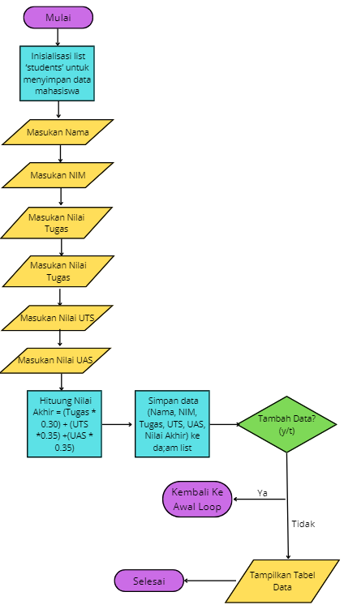
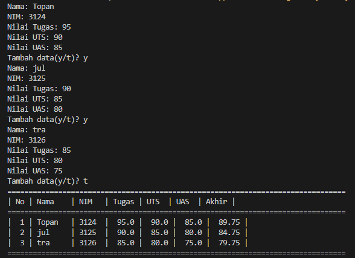

# labpy04

- Nama : Roufan Awaluna Romadhon
- NIM : 31210423
- Kelas : TI.24.A.3

---

## Deskripsi
Program ini dirancang untuk memungkinkan pengguna menambahkan data ke dalam sebuah list (daftar) di Python. List adalah struktur data yang dapat menyimpan berbagai jenis data dalam urutan tertentu. Program ini menggunakan input dari pengguna untuk menambahkan item ke dalam list, dan pengguna dapat memilih untuk menambahkan lebih banyak data sesuai kebutuhan.

---

## Program Membuat Data Nilai Mahasiswa

### Deskripsi Program:
Program ini bertujuan untuk mengelola data akademik mahasiswa dengan cara menerima input dari pengguna berupa Nama, NIM, Nilai Tugas, Nilai UTS, dan Nilai UAS. Setelah input data diterima, program menghitung Nilai Akhir berdasarkan bobot yang telah ditentukan, yakni 30% untuk nilai Tugas, 35% untuk nilai UTS, dan 35% untuk nilai UAS.

### Kode Program
Kode program dapat dilihat dibawah ini atau buka file ini [`ProgramNilai.py`](ProgramNilai.py).
```python
# List untuk menyimpan data mahasiswa
students = []

# Menghitung nilai akhir
def calculate_final_grade(tugas, uts, uas):
    return (tugas * 0.30) + (uts * 0.35) + (uas * 0.35)

# Program Nilai
while True:
    # Input data mahasiswa
    name = input("Nama: ")
    nim = input("NIM: ")
    tugas = float(input("Nilai Tugas: "))
    uts = float(input("Nilai UTS: "))
    uas = float(input("Nilai UAS: "))
    
    # Menghitung nilai akhir
    final_grade = calculate_final_grade(tugas, uts, uas)
    
    # Menyimpan data mahasiswa dalam list
    students.append({"No": len(students) + 1, "Nama": name, "NIM": nim, "Tugas": tugas, "UTS": uts, "UAS": uas, "Akhir": final_grade})
    
    # Tanya apakah ingin menambah data lagi
    add_more = input("Tambah data(y/t)? ")
    if add_more.lower() != 'y':
        break

# Tampilkan tabel data mahasiswa
print("="*80)
print("| No | Nama    | NIM   | Tugas | UTS  | UAS  | Akhir |")
print("="*80)

for student in students:
    print(f"| {student['No']:2} | {student['Nama']:7} | {student['NIM']:5} | {student['Tugas']:5} | {student['UTS']:5} | {student['UAS']:5} | {student['Akhir']:6.2f} |")

print("="*80)
# List untuk menyimpan data mahasiswa
students = []

# Menghitung nilai akhir
def calculate_final_grade(tugas, uts, uas):
    return (tugas * 0.30) + (uts * 0.35) + (uas * 0.35)

# Program Nilai
while True:
    # Input data mahasiswa
    name = input("Nama: ")
    nim = input("NIM: ")
    tugas = float(input("Nilai Tugas: "))
    uts = float(input("Nilai UTS: "))
    uas = float(input("Nilai UAS: "))
    
    # Menghitung nilai akhir
    final_grade = calculate_final_grade(tugas, uts, uas)
    
    # Menyimpan data mahasiswa dalam list
    students.append({"No": len(students) + 1, "Nama": name, "NIM": nim, "Tugas": tugas, "UTS": uts, "UAS": uas, "Akhir": final_grade})
    
    # Tanya apakah ingin menambah data lagi
    add_more = input("Tambah data(y/t)? ")
    if add_more.lower() != 'y':
        break

# Tampilkan tabel data mahasiswa
print("="*80)
print("| No | Nama    | NIM   | Tugas | UTS  | UAS  | Akhir |")
print("="*80)

for student in students:
    print(f"| {student['No']:2} | {student['Nama']:7} | {student['NIM']:5} | {student['Tugas']:5} | {student['UTS']:5} | {student['UAS']:5} | {student['Akhir']:6.2f} |")

print("="*80)
```

### Penjelasan Program:
1. Program dimulai dengan inisialisasi list `students` untuk menyimpan data mahasiswa.
2. Program memasuki loop di mana pengguna diminta memasukkan data mahasiswa, dimulai dengan memasukkan Nama.
3. Setelah nama dimasukkan, program meminta input NIM mahasiswa.
4. Selanjutnya, pengguna diminta memasukkan nilai Tugas untuk mahasiswa tersebut.
5. Setelah nilai tugas, pengguna memasukkan nilai UTS.
6. Kemudian, pengguna memasukkan nilai UAS.
7. Program akan menghitng nilainya.
8. Data yang terdiri dari Nama, NIM, Tugas, UTS, UAS, dan Nilai Akhir disimpan ke dalam list `students`.
9. Program menanyakan apakah pengguna ingin menambahkan data lagi dengan pertanyaan Tambah data? (y/t): Jika pengguna memilih `y`, program kembali ke langkah input nama dan mengulangi proses. Jika pengguna memilih `t`, program keluar dari loop.
10. Setelah keluar dari loop, program menampilkan tabel berisi daftar data mahasiswa yang telah dimasukkan.
11. Program selesai.

### Flowchart:
Flowchartnya adalah sebagai berikut:



### Screenshot Hasil Eksekusi Program:
Berikut adalah hasil eksekusi programnya:


